# 我反驳并批判了《看不见的女性》一书中的部分论点

本人只是粗略的找到了几个明显的事实性错误，如果还有问题，请到[Issues](https://github.com/mxkfemkkk/RefuteFemcelBook-invisible-Women/issues)，或者是到[我的B站主页](https://space.bilibili.com/134468753)和[我的知乎主页](https://www.zhihu.com/people/43fxma)找我留言，感谢。

> 雷人片段特别多，各位请悠着点看

## ⏹ 目录

- [TODO：看到仓库的你要怎么做](#-todo)

- [反驳该书论点：基于事实和数据的辟谣](#-反驳该书论点)

  - [反驳1：关于男女厕所分配问题](#反驳1关于男女厕所分配问题)
  - [反驳2：关于女性遭受性侵犯的问题](#反驳2关于女性遭受性侵犯的问题)
  - [反驳3：关于无偿工作](#反驳3关于无偿工作)
  - [反驳4 劳动时间](#反驳4-劳动时间)
  - [反驳5：钢琴适合男人？](#反驳5钢琴适合男人)
  - [反驳6：iPhone的手机尺寸](#反驳6iphone的手机尺寸)
  - [反驳7：医学图片问题](#反驳7医学图片问题)
  - [反驳8：女性更少求医问药？](#反驳8女性更少求医问药)
  - [反驳9：有关空调体温，是按照男性体温设计？](#反驳9有关空调体温是按照男性体温设计)

- [其他雷人片段](#-其他雷人片段)

- [参考文献](#参考-ref)

## ✅ TODO

- 支持我们的仓库（比如点个star），不要让谣言流传
- 长截图此仓库，让这篇文章传下去
- 尽可能地找到已有的造价，并提交[issues](https://github.com/mxkfemkkk/RefuteFemcelBook-invisible-Women/issues)反馈

**为男性发声需要你的帮助！**

## ❌ 反驳该书论点

### 反驳1：关于男女厕所分配问题

> 但是，即使男女厕所的隔间数相等，这个问题也不会得到解决，因为女性的如厕时间是男性的2.3倍。老年人和残障人士中，女性占大多数，而这两个群体上厕所的时间往往更长。女性也更有可能要陪同儿童、残疾人和老年人上厕所。此外，在任意时间段，还有20%至25%的育龄妇女正处在月经期，因此需要更换卫生棉条或卫生巾。
>
> ——摘自第一部分第二章《有小便池的中性厕所》

- **疑点1**：老年人和残障人士中女性占大多数？

然而事实情况是，我国残疾人性别比例达到了非常失衡的程度。

中国残疾人联合会发布的《2025中国残疾人事业统计年鉴》[^1]中的数据显示：2024年我国男性残疾人口21966678人，女性16283331人。性别比达到了惊人的134[^2]。

- **疑点2**：前提条件有问题——男女隔间数相等

澎湃新闻（2025）[^3]提供的数据显示：在大部分地区，男女厕位比例在1:2以上，有的地区是2:3，还有的地区是2:5。

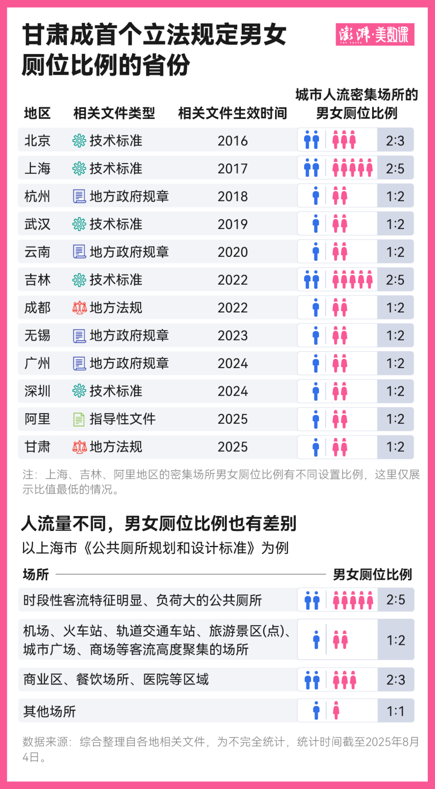

**关键问题01**：虚空打靶，现实是大部分地区男女坑位都在1:2以上，同时因为“2.3倍”一个数字是基于正常人的情况下得到，根本没有考虑过男性有着更多的残障人士。

**故**：无法适用于中国国情

**批判**：我非常支持女性为自己的生理需求发声，**但是本人反对一切借客观生理差异给男性卖赎罪券的**

**关键问题02**：多国数据拼凑，比如

> “……**孟买**的500万女性中有一半以上没有室内厕所”、“在田间小便的**印度**女性面临非伴侣性暴力的可能性是使用家庭厕所的女性的2倍”、“**加拿大和英国**的研究也表明，……”
>
> ——摘自第一部分第二章《有小便池的中性厕所》

多国数据放在一块讨论本来就没多大意义，娱乐就好

**关键问题3**：先入为主认为“老年人和残障人士中，女性占大多数”

**批判**：随口胡说谁都会，随口胡说的玩意儿还能被女性奉为圭桌是我没想到的。

**关键问题4**：不考虑实际需求

考虑厕所坑位数量，还要根据该场所男性较多还是女性较多。就比如说商场这样女性偏多的地方，公厕比例大于1:2就正常。

如果是明显男多女少的工地，厕所坑位则就不应该是1:2，而是2:3甚至更接近

**批判**：不考虑实际需求，只会根据所谓的如厕时间纸上谈兵

### 反驳2：关于女性遭受性侵犯的问题

> 城市规划没有考虑到女性遭受性侵犯的风险，这显然是对女性平等享有公共空间权利的侵犯，规划者以众多缺乏性别意识的设计将女性排除在外，卫生设施的不足只是其中之一。
>
> ——摘自第一部分第二章《有小便池的中性厕所》

~~*这里作者似乎已经忘记了这一章节的标题*~~

然后这位作者就开始列举她筛选的数据

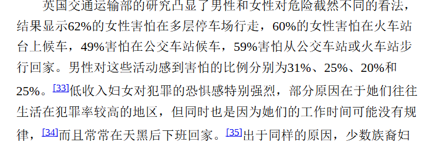

此时我们为什么不猜一下真实发生性暴力的概率呢？是不想吗？

这次我们把国内的数据和国际的数据联合起来看，你会有非常多有趣的发现

《中国(高校)反性骚扰/反性侵的几个关键问题》[^4]一文引用中国人民大学性社会学研究所于2000年、2006年、2010年、2015年完成了四次全国总人口随机抽样调查，结果显示：

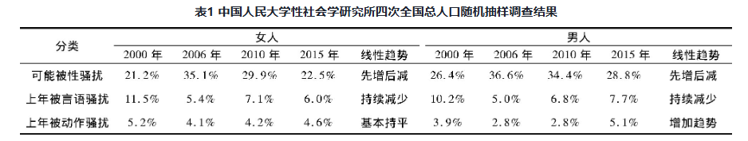

- 中国女性实际遭受性骚扰的总体情况稳中有降, 只是担心自己遭到性骚扰的人先增后减 。

- 男性遭受性骚扰的比例并不比女性低, 权力均衡主体间的性骚扰远多于权力高位者对低位者的性骚扰。

相信也有各位好奇同性别骚扰的比率，原文中提到了男性遭遇的同性别骚扰比率

> 同时, 女性对男性的性骚扰以及同性间的性骚扰均占相当比重。如, 男性遭受的言语性骚扰有42.4%来自女性、57.6%来自男性, 动作性骚扰则有94.1%来自女性、5.9%来自男性 ——《中国(高校)反性骚扰/反性侵的几个关键问题》

这里没有女性遭遇的同性别骚扰的比率，好在，我在性之变一书中找到了答案[^5]

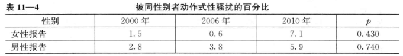

——**得出结论：女性的恐慌是女性造成的**

性暴力的实施情况呢？

《给“全性”留下历史证据》[^6] 中有人大调查的性暴力实施情况数据（就是没有同性别实施的数据，不过应该和同性别动作骚扰的数据差不了太大）：

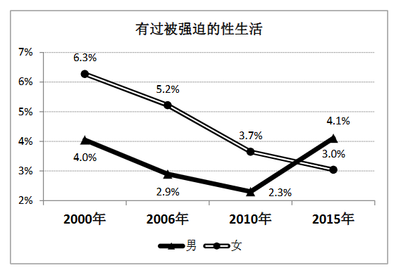

> 我知道，有一些人，打死也不会相信这种情况的。在他们的花岗岩脑袋里，只有男人强奸女人，甚至每个男人都在强奸每个女人，而且永远如此；绝对不可能出现女人强奸男人的事情。对这样的人来说，事实一文不值，他们永远活在自己的想象与主张之中。因此，我的这个文章不是给他们看的，我也没有义务去教育他们睁开眼睛。——《给“全性”留下历史证据》

再来看看国外数据[^7]

> 据CNN报道，《美国医学会》杂志发布的一项研究显示，在14至21岁的青少年中，有近十分之一的人称自己曾实施过某种性暴力，无论男女。这个研究还发现，在18岁之后，有52%的男性和48%的女性实施过性暴力，这一相近的比例令人惊讶。
>
> 据美国疾病防控中心进行的一项全国性调查显示，在男性性侵案件中，有68.6%的实施者都是女性。而2014年一项对284名男性大学生及高中生的调查发现，43%的人声称自己受到过性胁迫，而这其中95%都是女性侵犯者。

同时还要提一嘴人大潘教授的调查发现：

> 其二，**认为自己可能被骚扰的人越来越多，已经达到近乎荒唐的地步；可是实际上，真的受到过性骚扰的人却少得可怜；两者相差几乎 10 倍**。
> 这种情况，往好里说，正是因为“人人自危，个个警惕”，才使得性骚扰“确实很少”。可是如果往坏里说，则是全社会对于性骚扰出现了严重的焦虑，甚至有些“杞人忧天”了

最后附上这位作者的离谱调查数据了，我就只挑几个离谱的反驳

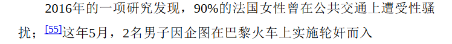

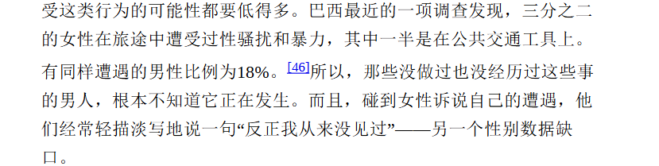

找到90%这一出处的报道原文后[^8]，我发现，这里的性骚扰定义特别宽泛，也特别不明确：

这是潘绥铭对性骚扰的定义，对比一下就行了

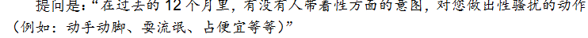

三分之二的女性旅途中受到过性骚扰我查不到原始数据，因为原作者在书中的引用里只有作者名（甚至都没给全名）和年份，我也不打算费那事检索了。

**批判**：有关性骚扰性暴力的论文PubMed或者ScienceDirect有特别多，只要留心观察一下就会发现部分研究得出结论——性骚扰方面：男女存在性别对称性。然而作者忽略了这些研究，摆出了她的不知来源的数据。可见这篇文章立场大于事实的严重性

### 反驳3：关于无偿工作

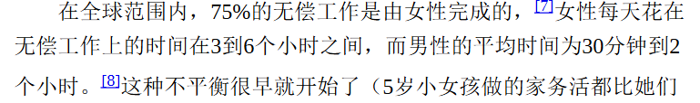

首先不可否认，家务活确实是女性做的多

但是，作者有点过分的一点是：因为无偿劳动差别较大，直接将男性定义为“男性则继续追求休闲”

我们不妨看一下国内的数据，看看究竟是否是这样

> 有酬劳动领域的参与者每日平均时间为6小时23分钟。**其中，男性6小时44分钟，女性5小时55分钟；**城镇居民6小时23分钟，农村居民6小时22分钟；6—17周岁居民4小时21分钟，18—59周岁居民6小时32分钟，60周岁及以上居民5小时30分钟。
>
> 有酬劳动领域的活动参与率为54.1%。其中，男性60.2%，女性47.7%；城镇居民52.1%，农村居民57.9%；6—17周岁居民1.2%，18—59周岁居民75.6%，60周岁及以上居民36.3%。[^9]

> 无酬劳动领域的参与者每日平均时间为2小时45分钟。其中，男性1小时52分钟，女性3小时29分钟；城镇居民2小时44分钟，农村居民2小时46分钟；6—17周岁居民36分钟，18—59周岁居民2小时42分钟，60周岁及以上居民3小时31分钟。
>
> 无酬劳动领域的活动参与率为75.6%。其中，男性67.5%，女性83.9%；城镇居民76.0%，农村居民74.8%；6—17周岁居民33.7%，18—59周岁居民82.7%，60周岁及以上居民88.9%。

看起来，是男人和女人工作时间差异不大，对吧

**请注意——职场女性和全职太太是不一样的**

> 每天操持家务1小时以上的女性达50.9%，高于男性的45.2%。[^10]

如果你结合有偿劳动和无偿劳动总时间来看，**男性是超过女性的。那么女性家务比男性多的一部分，算是合理的**。

### 反驳4 劳动时间

> 《经济学人》并不是唯一一个在讨论“工作"时忘记了女性无偿工作量的杂志。当像《公司》一类商业杂志发表深度报道，声称“科学"告诉我们，“你"每周的工作时间不应超过40小时，或者当《卫报》郑重告知，如果你每周工作超过39个小时，“你的工作可能会要了你的命”，他们的告知对象并不是女性，因为对女性来说，这里压根没有“如果”。女性的工作量远超这个数字，并且长年如此。而且这种情况确实正在要她们的命。
>
> ——摘自第二部分第三章《漫长的星期五》

这里我们拿国家统计局调查公报的数据换算一下[^9]

- **男性平均每周**：47.7 h （有酬劳动）+ 13 h = 60.7h
- **女性平均每周**： 41.4h + 24.3 h =65.7 h

女性平均每周多5小时，换算过来，平均每天比男性多干0.7 h约合42分钟活

同时，看到了劳动时间T，不要忘记劳动功率P。T可以估测，P很难估测。

**批判**：摘樱桃大法——只公布了“女性工作时长远高于40h”，却没公布“男性工作时长同样高于40h”，且这还是没有算劳动功率（$P$）的情况下的出来的。可见本书作者把春秋笔法体现的淋漓尽致

### 反驳5：钢琴适合男人？

> 所谓的性别中立产品到头来只“适合所有男人”，这种做法对女性不利。女性的平均手长在18到20厘米之间，[2]这使得标准的48英寸（约为121厘米）钢琴键盘成了一个挑战。标准键盘上的八度音阶为18.8厘米宽，一项研究发现，这种键盘对87%的成年女性钢琴家不利。[3]与此同时，2015年的一项研究将473名成年钢琴家的手长与他们的“受欢迎程度”进行了比较，结果发现，12名被认为具有国际知名度的钢琴家的手长都在22厘米以上。[4]只有2名女性进入这一崇高的群体，其中一名手长23厘米，另一名24厘米。
>
> ——第三部分 设计第8章 适合所有人的尺寸

这一点也是我个人认为最离谱的一段（甚至都不用我找数据就能反驳）

钢琴发明于1709年（此时还没进入工业革命），现代钢琴结构1825年固定下来，此后再也没有多大变化。

**但钢琴没多大变化，男性手长和女性手长在变化啊！**

此时便有两种可能

- 最开始：钢琴是为女性量身定做的，后续体质发展，钢琴便更适合男性
- 最开始：钢琴是为男性量身定做的，后续体质发展，钢琴应该更适合女性，但因为女性不努力，所以人才少。

最后放几个钢琴家的实例证明吧：

> 巴伦的手为8~9度，大约17厘米左右。斯克里亚宾的手**只有八度**（14.5—16.7cm之间），远远低于女性平均手长18-20cm。

这边再来一个CDC（美国疾控中心）1950-2001年的变化数据[^15] (《Relative change in hand size over time: implications for glove-size schemes and labeling for end-users.》2003.6 p1)

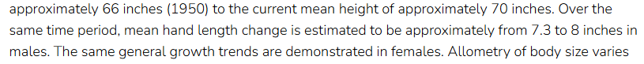

> 翻译：在同一时期，男性平均手长的变化估计从约7.3英寸增加到8英寸。女性也显示出相同的总体增长趋势。

众所周知，1英寸=2.54cm

7.3英寸=18.542cm

那么，在1950年的时候，男性平均手长18.5cm，**和现在女性的平均手长差不太多（18-20cm）**

由前文可知，现代钢琴结构早在1825年就已经确定。

**也就是说，钢琴最开始发明的时候如果真的只给男性量身定做，那么现在的钢琴应该适合女性才对**

为什么女性获得的荣誉不多呢，嗯……不说了

**同时不要忘记女权主义者自己提出的理论——个体差异大于群体差异**——手长这些因素可以通过后期训练来避免。

**批判**：该书作者在写书的时候并没有认真查阅钢琴的发展史，也没有认真考据男性的手长的变化趋势，只是强行的为炒作“女性看不见”随手编造谣言。

### 反驳6：iPhone的手机尺寸

我觉得应该是最雷人的一段了

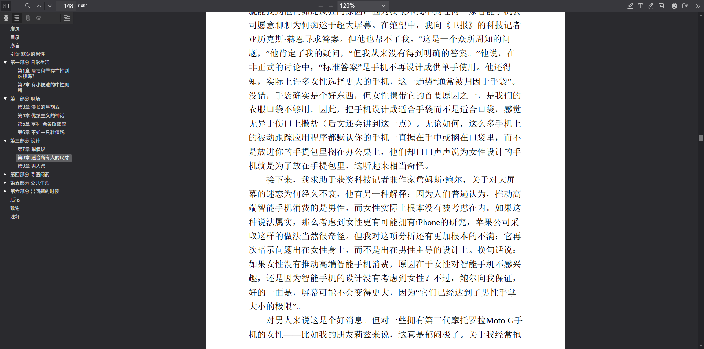

为什么不继续更小屏手机了？

**答**：因为距离远了看不清费眼睛

就这么简单

再来看统计数据：iPhone SE系列貌似可不在女生群体内受欢迎

>  数据统计结果显示，男生果粉们特别偏好入手高端旗舰的iPhone Pro机款、约占41%， 女生果粉们则是对于标准版的iPhone机款较为青睐，约占33%。有趣的是，偏好小尺寸4.7英寸iPhone SE 机型的手持握感，果粉们男女族群则趋向一致，占比皆为7%左右。[^11]

### 反驳7：医学图片问题

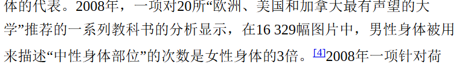

图片是根据患病率和死亡率来看的

就比如说这个——

你是教材制定者，你选择到男性标本的可能性大还是女性标本的可能性大？

### 反驳8：女性更少求医问药？

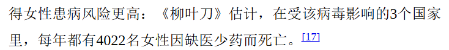

这里我放个世界卫生组织的数据

> 　世卫组织特别选在7日“世界卫生日”到来之际发布《2019年世界卫生统计》。该报告首次按性别分列数据，有助于更好地了解世界各地人们的健康状况和需求。报告发现，全球范围内女性预期寿命均超过男性，在富裕的发达国家尤其如此。
>
> 　　**究其原因，主要是因为两性对待卫生保健的态度不同，在面临同样疾病时，男性往往比女性更少去求医问药。例如，在艾滋病流行国家，男性接受艾滋病病毒检测和相应治疗的可能性比女性都低，死于艾滋病相关疾病的可能性则高于女性。同样，男性结核病患者似乎不会像女性患者那样去积极寻求治疗。**
>
> 　　报告显示，在导致死亡的40个主要原因中，有33个会导致男性预期寿命低于女性。[^12]

**批判**：摘樱桃大法，丝毫不提男性的现状怎样

### 反驳9：有关空调体温，是按照男性体温设计？

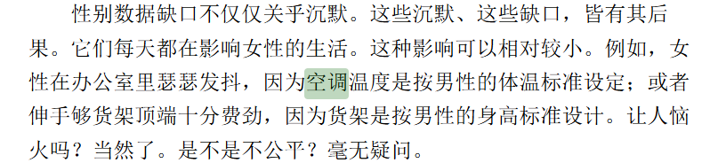

真实情况是：在Robert J. Brychta等(2024)[^13]发表在PNAS期刊的文章中：测量了健康、体型偏瘦的年轻女性和男性在日常环境温度范围（17 至 31 °C）内的体温反应。**发现：女性的下限临界温度较低**。

以下是该文章的主要观点

- **女性比男性更“耐寒”**传统观念认为女性更怕冷，但本研究发现在相同低温环境下，**女性比男性更晚启动产热机制**，表现出更“北极型”的体温调节特征。

- **下临界温度更低**：女性的**下临界温度**（即开始需要额外产热维持体温的环境温度）平均为 **21.9°C**，男性为 **22.9°C**，女性显著更低。

- **体脂是重要影响因素**：女性更高的体脂百分比提供了更好的**隔热效果**，抵消了因体型小导致的低基础代谢率，从而使她们在更低温下才需要启动产热。

- **性别差异主要由体型和体成分决定**研究未发现男女性在棕色脂肪活性、肌肉颤抖、皮肤温度、主观冷感等方面有显著差异，说明**性别本身不是决定性因素**，而是体型、体脂等生理特征的影响。

出现这种结果我丝毫不意外，**原因在于：**

 **是否寒冷，往往取决于体脂率**

体脂率越高，**就越抗热**

在GBD2021的研究数据中（发表于《Global, regional, and national prevalence of adult overweight and obesity, 1990–2021, with forecasts to 2050: a forecasting study for the Global Burden of Disease Study 2021》一文，2025.3）[^14]，指出：

> Conversely, for obesity alone, prevalence among females was consistently higher than that of males across all super-regions. However, the gap between sexes was more substantial in low-income and middle-income regions, such as sub-Saharan Africa and south Asia. In sub-Saharan Africa, in terms of relative percentage differences, the prevalence of obesity in females was over 100% higher than that in males for those aged 25–79 years. Between the ages of 50 years and 69 years, the relative percentage differences were over 140%. The smallest difference in obesity prevalence between males and females was observed in the high-income super-region, where the relative percentage difference was below 20% under age 70 years and increased moderately to 30–40% in older ages ([appendix 1 p 48](https://pmc.ncbi.nlm.nih.gov/articles/PMC11920007/#sec1)).
>
> 译自Google：相反，就肥胖而言，在所有超级区域中，女性的患病率始终高于男性。然而，在撒哈拉以南非洲和南亚等低收入和中等收入地区，性别差异更为显著。在撒哈拉以南非洲，就相对百分比差异而言，25-79岁人群中女性的肥胖患病率比男性高出100%以上。在50-69岁人群中，相对百分比差异超过140%。在高收入超级区域中，男性和女性肥胖患病率的差异最小，70岁以下人群的相对百分比差异低于20%，随着年龄增长，差异适度增加至30-40%（[附录1，第48页](https://pmc.ncbi.nlm.nih.gov/articles/PMC11920007/#sec1)）。

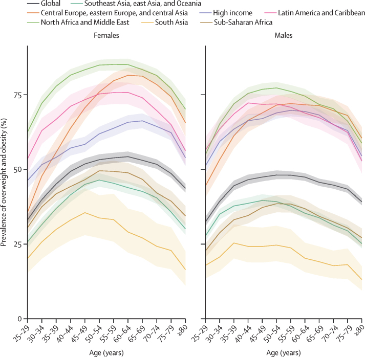

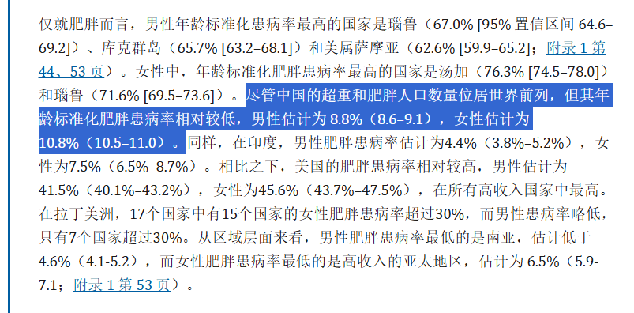

（图源PubMed）

——**如果按照这样推断的话：空调应该是偏向女性设计的才对**

**批判**：和其他地方同样，先入为主地认为某个假命题是“真”命题。

### 反驳10：心血管疾病的早期研究在男性身上举行（鸣谢[Kyoukai](https://www.zhihu.com/people/karanokyoukai)）

> 教科书中能否包含性别信息，取决于性别数据的可获得性，但由于女性在很大程度上被排除在医学研究之外，这方面的数据严重匮乏。大多数心血管疾病的早期研究都是在男性身上进行的，而女性的参与比例始终很低，1987年至2012年间，人们进行了31项里程碑式的充血性心力衰竭试验，而其中女性参与者仅占25%。
>
> ——摘自第四部分第十章《无用之药》

**第一点**：参与者比例应当取决于患病率

**第二点**：据我所知，这本书2017年开始撰写，犯得着用1987年的数据吗？

况且，即使你有什么特殊癖好，对数据这一块喜旧厌新，你也明明可以搜到这些数据

——第一篇：《柳叶刀》2003年《Effects of candesartan in patients with chronic heart failure and preserved left-ventricular ejection fraction: the CHARM-Preserved Trial》[^16]

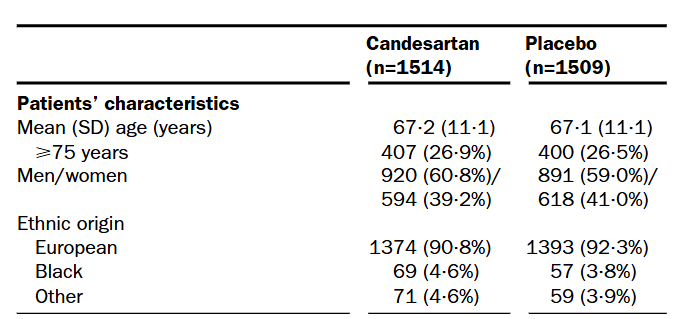

女性参与者39.2% 、41%

——第二篇：2008年《Irbesartan in patients with heart failure and preserved ejection fraction》[^17]

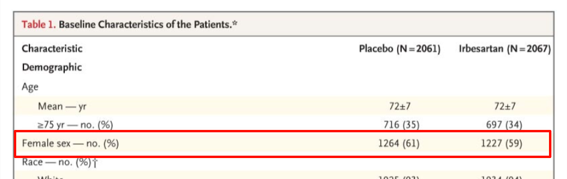

女性参与者60%

——第三篇《Adverse effect of ventricular pacing on heart failure and atrial fibrillation among patients with normal baseline QRS duration in a clinical trial of pacemaker therapy for sinus node dysfunction》2003年[^18]

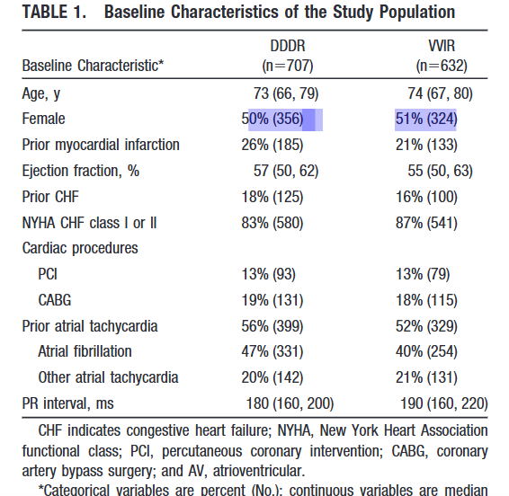

女性占比50%

**为了防止有《看不见的女性》一书出版后医学界才重视这种鸡叫日升的言论，我还特意只搜集了2010年以前的文献** 。其它的我不过多赘述，感兴趣的可以自己用PubMed或者ScienceDirect搜一下CVD类疾病女性占比超过原著中所写的25%的有多少？！

## ❗ 其他雷人片段

这些我就不细说了，自己看看吧

**01**

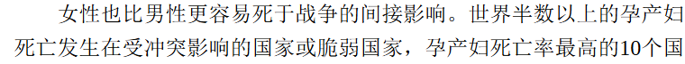

**02**

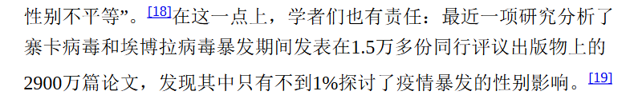

**03**

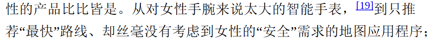

## 参考 Ref

[^1]: 中国残疾人联合会.2025中国残疾人事业统计年鉴[EB/OL].2025 https://www.cdpf.org.cn/zwgk/zccx/ndsj/zhsjtj/2024zh/8078083de707498c8262120634a26645.htm
[^2]: 这里的残疾指的是已办理证件残疾人 
[^3]:澎湃新闻. 甘肃立法明确男女厕位比例，能解决女厕排长队的问题吗？[EB/OL].2025. https://www.thepaper.cn/newsDetail_forward_31302908
[^4]:  赵军, 武文强. 中国(高校)反性骚扰/反性侵的几个关键问题[J]. 河南警察学院学报, 2018, 27 (03): 47-51.
[^5]: 潘绥铭，黄盈盈著《性之变：21世纪中国人的性生活》中国人民大学出版社 2013.7
[^6]: 潘绥铭 《给“全性”留下历史证据》1908出版社 2018.4
[^7]:  凤凰网.男人被性侵比想象中更普遍，美疾控中心：近七成作案者为女人[EB/OL].2017. https://news.ifeng.com/c/7fa41uTGKQ0
[^8]: The Local France .'Half of French women' alter clothes to avoid harassment[EB/OL].2016 https://www.thelocal.fr/20160615/half-of-french-woman-alter-clothes-to-avoid-harassment
[^9]: 中国政府网.第三次全国时间利用调查公报（第三号）[EB/OL].2024.https://www.gov.cn/lianbo/bumen/202410/content_6984100.htm
[^10]:  http://m.cnhubei.com/content/2022-03/07/content_14556628.html
[^11]: https://m.cnw.com.cn/show-68-68-21749.html
[^12]: https://news.cctv.com/2019/04/09/ARTILIejbTq4FOrV3VCRvOcw190409.shtml

[^13]:R.J. Brychta, S. McGehee, S. Huang, B.P. Leitner, C.J. Duckworth, L.A. Fletcher, K. Kim, T.M. Cassimatis, N.S. Israni, H.J. Lea, T.N. Lentz, A.E. Pierce, A. Jiang, S.R. LaMunion, R.J. Thomas, A. Ishihara, A.B. Courville, S.B. Yang, M.L. Reitman, A.M. Cypess, & K.Y. Chen, The thermoneutral zone in women takes an “arctic” shift compared to men, Proc. Natl. Acad. Sci. U.S.A. 121 (19) e2311116121, https://doi.org/10.1073/pnas.2311116121 (2024).
[^14]:GBD 2021 Adult BMI Collaborators. “Global, regional, and national prevalence of adult overweight and obesity, 1990-2021, with forecasts to 2050: a forecasting study for the Global Burden of Disease Study 2021.” *Lancet (London, England)* vol. 405,10481 (2025): 813-838. doi:10.1016/S0140-6736(25)00355-1
[^15]: https://stacks.cdc.gov/view/cdc/181138
[^16]: Yusuf, Salim et al. “Effects of candesartan in patients with chronic heart failure and preserved left-ventricular ejection fraction: the CHARM-Preserved Trial.” *Lancet (London, England)* vol. 362,9386 (2003): 777-81. doi:10.1016/S0140-6736(03)14285-7
[^17]: Massie, Barry M et al. “Irbesartan in patients with heart failure and preserved ejection fraction.” *The New England journal of medicine* vol. 359,23 (2008): 2456-67. doi:10.1056/NEJMoa0805450
[^18]: Sweeney, Michael O et al. “Adverse effect of ventricular pacing on heart failure and atrial fibrillation among patients with normal baseline QRS duration in a clinical trial of pacemaker therapy for sinus node dysfunction.” *Circulation* vol. 107,23 (2003): 2932-7. doi:10.1161/01.CIR.0000072769.17295.B1